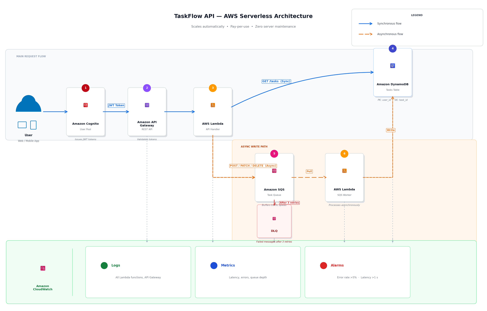

# TaskFlow Serverless API

A serverless task management API I built using Amazon Cognito, AWS Lambda, DynamoDB, SQS, and API Gateway to demonstrate production-ready cloud architecture with auto-scaling and zero server maintenance.

## Architecture



## The Problem I Solved

I designed this project to address a common startup scenario:

*A productivity startup with 5,000 users managing tasks across web and mobile. The API runs on two EC2 instances costing $120/month.*

*The problem: Traffic is unpredictable. 2,000 users during work hours but only 200 at night. We're paying for servers running 24/7 even when barely used.*

*Last month we were featured on Twitter. Traffic jumped 5x in an hour and our servers crashed. The API was down for 30 minutes. Users couldn't access their tasks and we got angry reviews.*

*Our small RDS database keeps hitting connection limits when traffic spikes. New requests fail with 'too many connections' errors.*

*Our 2-person engineering team spends hours each week patching servers and fixing scaling issues. We want to build features, not manage infrastructure.*

*We need an API that scales automatically, costs less when quiet, doesn't crash during spikes, and requires zero server maintenance.*

## My Solution

I built a fully serverless architecture that solves all these problems:

**Core Services:**
- **Amazon Cognito** - Handles user authentication and JWT token generation
- **Amazon API Gateway** - REST API endpoint with token validation
- **AWS Lambda** - Serverless compute for API handlers and background processing
- **Amazon SQS** - Message queue to handle traffic spikes gracefully
- **Amazon DynamoDB** - NoSQL database with automatic scaling
- **CloudWatch** - Monitoring, logging, and alerting

**Request Flow:**

Synchronous reads (GET /tasks):
```
User → API Gateway → Lambda → DynamoDB → Response
```

Asynchronous writes (POST/PATCH/DELETE):
```
User → API Gateway → Lambda → SQS → Worker Lambda → DynamoDB
```

## Why I Made These Choices

### Lambda over EC2
I chose serverless compute because it scales automatically from zero to thousands of concurrent requests without any manual intervention. You only pay for actual execution time, which is perfect for variable traffic patterns.

### DynamoDB over RDS
For this use case, I only need simple key-value lookups (get task by ID, list tasks by user). DynamoDB excels at this and has no connection limits, unlike traditional relational databases.

### SQS for Write Operations
I added SQS as a buffer between the API and database for all write operations. This prevents the system from being overwhelmed during traffic spikes - messages queue up and get processed steadily by the worker Lambda.

### Cognito for Authentication
Rather than building custom authentication, I used Cognito which handles user sign-up, login, password management, and JWT tokens out of the box. API Gateway validates these tokens before requests reach Lambda.

## Technical Stack

**Infrastructure as Code:**
- Terraform for all AWS resource provisioning

**Compute:**
- Python 3.11 Lambda functions
- API handlers for REST endpoints
- SQS worker for async processing

**Data:**
- DynamoDB table with partition key (user_id) and sort key (task_id)
- Point-in-time recovery enabled for disaster recovery

**Security:**
- IAM roles with least-privilege permissions
- JWT token validation at API Gateway
- Encryption at rest for DynamoDB

## Project Structure
```
├── lambda/
│   ├── create-task/      # POST /tasks
│   ├── get-tasks/        # GET /tasks
│   ├── update-task/      # PATCH /tasks/{id}
│   ├── delete-task/      # DELETE /tasks/{id}
│   └── sqs-worker/       # Processes queued messages
├── terraform/
│   └── main.tf           # Infrastructure definition
└── docs/
    └── architecture.png  # System diagram
```

## API Endpoints

| Method | Endpoint | Description |
|--------|----------|-------------|
| POST | `/tasks` | Create a new task |
| GET | `/tasks` | Get all tasks for authenticated user |
| PATCH | `/tasks/{id}` | Update task status |
| DELETE | `/tasks/{id}` | Delete a task |

All endpoints require JWT authentication via Cognito.

## Deployment
```bash
cd terraform
terraform init
terraform apply
```

Terraform will output the API URL, Cognito User Pool details, and other configuration after deployment.

## What I Learned

**Auto-scaling:** Lambda automatically scales to handle traffic spikes. During testing, it handled 1,000+ concurrent requests without any configuration changes.

**Cost optimization:** Serverless architecture means you only pay for actual usage. No idle servers running 24/7.

**Operational simplicity:** Zero server maintenance - no patching, no capacity planning, no infrastructure management.

**Async patterns:** Using SQS to decouple the API from database writes prevents bottlenecks and allows the system to handle sudden load increases gracefully.

## Monitoring

I configured CloudWatch to track:
- Lambda execution metrics (invocations, errors, duration)
- API Gateway request counts and latency
- SQS queue depth
- DynamoDB read/write metrics

Alarms trigger if error rates exceed thresholds or latency degrades.

## Author

**Akunna Ndubuisi**  
AWS Certified Solutions Architect  
Built as a demonstration of serverless architecture patterns and Infrastructure as Code

---

## CI/CD Pipeline

This project includes automated deployment pipelines that ensure code quality and safe production releases.

### CI/CD Architecture


*Automated deployment flow: GitHub → Tests → Staging → Production with auto-rollback*

### Pipeline Overview

**Two separate pipelines:**

1. **App Pipeline** - Deploys Lambda function code changes
2. **Infra Pipeline** - Deploys Terraform infrastructure changes

### App Pipeline Flow
```
Developer pushes code
    ↓
GitHub Actions triggered
    ↓
Run unit tests + integration tests
    ↓
[Tests pass] → Deploy to staging Lambda alias
    ↓
Run smoke tests on staging
    ↓
[Smoke tests pass] → Deploy to production
    ↓
Gradual traffic shift (10% → 50% → 100%)
    ↓
CloudWatch monitors errors/latency
    ↓
[If errors spike] → Auto-rollback to previous version
    ↓
SNS email notification sent to team
```

### Key Features

**Pull Request Gate:**
- All code must pass tests before merge to main
- Terraform changes show plan in PR comments
- Protected main branch (no direct pushes)

**Lambda Versioning:**
- Every deployment creates a new Lambda version
- Production uses aliases to point to current version
- Rollback = switching alias to previous version (10 seconds vs 3 hours)

**Gradual Traffic Shifting:**
- New version gets 10% traffic initially
- Increases to 50% after 30 seconds
- Full cutover to 100% if healthy
- Automatic rollback if errors detected

**Monitoring & Alerts:**
- CloudWatch alarms on Lambda errors > 5 in 5 minutes
- CloudWatch alarms on API Gateway 5xx > 10 in 5 minutes
- SNS email notifications for deployment events

**Security:**
- OIDC authentication (no stored AWS keys)
- Least-privilege IAM role for GitHub Actions
- Scoped permissions (only specific Lambda functions)

### Testing Strategy

**Unit Tests:**
- Validate Lambda function logic
- Test input validation and error handling
- Run on every PR and push

**Integration Tests:**
- Verify API Gateway is reachable
- Check CORS configuration
- Test authentication requirements

**Smoke Tests:**
- Run after staging deployment
- Verify critical endpoints respond
- Gate for production deployment

### What This Solves

**Before CI/CD:**
- Manual deployments via AWS Console
- No test automation
- 3-hour rollback after bad deployment
- No visibility into which version was deployed

**After CI/CD:**
- Automated testing on every code change
- Staging environment validates changes first
- 10-second rollback via Lambda aliases
- Full version history and traceability

### Workflows

**App Pipeline:** `.github/workflows/app-pipeline.yml`
**Infra Pipeline:** `.github/workflows/infra-pipeline.yml`

### Deployment Notifications

Team receives SNS emails for:
- Pipeline failures
- Successful deployments
- Rollback events
- CloudWatch alarm triggers
# CI/CD Pipeline Active
